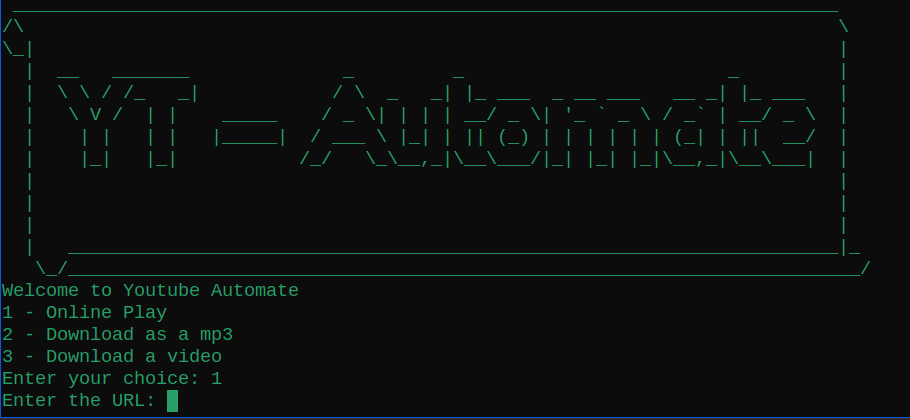

# YT-Automate

A simple script to use and automate the **yt-dlp** library.

---

## Features

- Play videos online
- Download videos as MP3
- Download videos in original formats

---

## Installation

```bash
# Clone the repository
git clone https://github.com/vanu888/YT-automate.git

# Navigate to the project directory
cd YT-automate

# (Optional) Create and activate a virtual environment
python3 -m venv venv
source venv/bin/activate

# Install dependencies
pip install -r requirements.txt
```

---

## Usage

```bash
# Make the script executable and run it
chmod +x yt-automate.sh
./yt-automate.sh
```

---

## Example



---

## Project Structure

```text
YT-automate/
├── yt-automate.sh
├── README.md
├── requirements.txt
├── LICENSE
└── assets/
    └── example.png
```

---

## Tools and Technologies

- Python 3
- Bash / Linux

---

## Contributing

Contributions are welcome.  
Feel free to open an issue or submit a pull request.

---

## License

This project is licensed under the [MIT License](LICENSE).

---

## Author

- GitHub: [@vanu888](https://github.com/vanu888)

